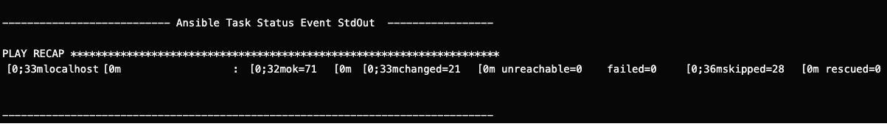

# Overview

This repository provides the means to stand up and experiment with autoamted governance and piplines as a service using the Ploigos Everything workflow, OpenShift, OpenShift Pipeslines (Tekton), and OpenShift GitOps (ArgoCD).

There are four (4) large tasks to setup and run the demo:

1. First    - Install the all the automated governance tools & systems 
  a. Ploigos Software Factory Opertor
  b. `PloigosPlatform`
2. Second   - Install the  Ploigos Pipeline, and the demo application
3. Thrid    - Update the Ploigos Platform configuration
4. Fourth   - Expose the Pipeline as a Service, and onboard the demo application

## Before You Start

Make sure the following components are installed on your local machine

- [OpenShift cli](https://docs.openshift.com/container-platform/4.7/cli_reference/openshift_cli/getting-started-cli.html) - Create applications and manage OpenShift Container Platform projects from a terminal.
- [yq cli](https://github.com/mikefarah/yq) - A lightweight and portable command-line YAML, JSON and XML processor.

This demo assumes your kubernetes distribution is OpenShift 4.x, and  you have cluster administrator rights.  If you do not have an OpenShift cluster with these rights, we recommend a cluster from one of the Red Hat cloud partners.  

- [OpenShift on Microsoft Azure](https://www.redhat.com/en/technologies/cloud-computing/openshift/try-it)
  - At the time of writing these instructions, there is a 30-day free developer trial.
- [OpenShift on Amazon Web Services](https://aws.amazon.com/quickstart/architecture/openshift/)
  - At the time of writing these instructions, there is a demo trial available if you complete some questionaire information.

You can use [OpenShift Local](https://developers.redhat.com/products/openshift-local/overview) as well.  The only limitation with local development is the inability for anyone else to access your cluster.

## Setup Instructions

1 . Ensure you have an OpenShift 4.x cluster running and accessible to you.

2 . Log into your cluster `oc` cli.  You'll need a terminal and web browser to complete this task.

  - Access the OpenShift web console.
  - At the top right of the web console, you'll see your username, click it.  This will drop down a submenu with a couple options.
  - Click  the `Copy login command` option.  This will open a new webpage with the blue text of `Display Token` at the top left-hand side of the page.  
  - Click on `Display Token`. Once clicked, the webpage will refresh with some information. 
  - Find the header `Login with this token`
  - Under the header `Login with this token`, you will see a login command that beings with `oc login --token= ...`.  It will resmeble a command such as this one:

  *Sample OC Login Command*

  ```shell
  oc login --token=sha256~12dHbGNWjMhnuJ7-qhx9tAMnjrJaRpfdswo2HoXUy8_0 --server=https://api.ci-ln-1ldd90k-72292.aws.dev.cloud.com:6443
  ```

  - Copy the full `oc login --token= ...` command from your web browser, and paste it into your termainal. Invoke the command in your terminal and follow the directions.  DO NOT COPY AND PAST THE SAMPLE OC LOGIN COMMAND, IT WILL NOT WORK.
  - Validate you're logged in by invoking the commaned `oc get status`.  The terminal will ouput  information. The first line will say `In project default on server ...`.  
  - You are succesfully logged in if the response has the exact server used in the oc login command.

2 . Clone this repository.  We will mutaate, and add files as part of the demo.  Either clone via SSH or HTTPS.

- Clone with SSH remote:

  ```shell
  git clone git@github.com:ploigos-automated-governance/demo-postinstall.git
  ```

- Clone with HTTPS remote:

  ```shell
  git clone https://github.com/ploigos-automated-governance/demo-postinstall.git
  ```

Once cloned, navigate into the cloned project directory.  We will begin our installation from the cloned project directory.

### First, Install the automated governance tools & system

#### What To Exepct Form This Step

This step gets you up and running with all  tooling and systems you need. You'll have done the following when complete with section.

- Installation and basic configuration for the following tools in the `devsecops` namespace:
  - Gitea - Source Code Repo
  - OpenShift Pipelines (Tekton) - Continuous Integration
  - OpenShift GitOps (ArgoCD) - Continuous Deployment
  - Nexus - Artifact Repository & Container Registry
  - SonarQube - Static Code Analysis
  - Selenium - User Acceptance Testing
- Installation and basic configuration for the following tools in the `sigstore` namespace:
  - Rekor - Transparency Log

There are some baked in assupmtions with this install.  They are as follows:

- The kubernetes distribution is OpenShift 4.x
- You are not using the namespaces
  -  `devsecops`
  -  `sigstore`

#### Step #1 Directions

Let's install and configure the software factory!  We are using a kustomize application to simplify this process.

**1 . Clone the Ploigos Automated Governance Platform repository.**

  ```shell
  git clone git@github.com:ploigos-automated-governance/2-platform-ops.git
  ```

**2 . Navigate to the cloned repo root folder: `2-platform-ops`. Begin the software factory installation with the following commands.**

  ```shell
  oc apply -k argo-cd-apps/overlays/ploigos-software-factory
  oc delete limitrange --all -n devsecops
  oc delete limitrange --all -n sigstore
  ```

  The first command is invoking the install.  The second two commands, `oc delete limitrange ...` are there as a precaution.  Some OpenShift configurations will set compute, storage, and memory limits on newly created namespaces.  For this demo, we are going to remove those limits.

  **Get An Error?**
  If you recieved an error about the `PloigosPlatform` not being found, simply re-invoke the commands.  
  
  Why did this happen? There is a `PloigosPlatform` custom resource that is invoked as part of the kustomize app.  This `PloigosPlatform` resoruce depends upon the sofware factory operator being completly registered.  It may happen that the operator has not registered the customer resource definitions by the time the `PloigosPlatform` resource is invoked.

  **NOTE**
  This begins the 5 - 10 minutes to installation process.  If the network connection is slower than normal, this could take upwards of 15 minutes.
  
  To validate the platform has been set up properly, you can do any of these two actions:

  - Within the `devsecops` project, access the logs of the pod named: ```
ploigos-operator-controller-manager-[random-characters-here]```. If complete, the logs will be done generating, and you'll see a meassage like this:

  

  - Within the project `devsecops`, navigate the `Routes` by finding the `Networking` selection on the side nav menu.  Click the `Networking` selection, then in the networking submenu select `Routes`.  With the exception of `nexus-docker`, you should be able to access each web interface.

Once you have validated all software factory componenets are up and running, being the next step.

**3 . Install the SigStore components, Rekor.**

```shell
oc apply -f argo-cd-apps/app-of-apps/simple-software-supply-chain-platform.yml
```

Installing Rekor should talk about 3 - 5 minutes.  You can validate Rekor is up-and-running by navigating to the `Routes` within the `sigstore` namespace.  Follow the same directions that were provided in step 1, although use the `sigstore` namespace.

Click on the `rekor-server-route` Location, and you'll get a simple website with the heading `Rekor Server`.

**4 . Resize the Nexus PVC**

The default storage size is not enough for continued use with this demo.  Therefore, we need to increase it from it's current setting to 100 Gib.

Using the OpenShift web console, withing the `devsecops` namespace:

- Use the left hand naviation to navigate to `Storage` -> `PersistentVolumeClaims`
- Search for *nexus-sonatype-nexus-data*
- Select the `nexus-sonatype-nexus-data` pvc
- Once selected, you'll see information about the PVC.  At the top right-hand side of the web sconcoles you'll see an `Actions` dropdown option, selection
- Within `Actions`, select `Expand PVC`
- Update to 100 GiB
- Select "Expand"
- Once complete, restart the nexus pod.  Still within the `devsecops` project, use the left hand navigfation to go to `Workloads` -> `Pods`
- Find the pod that starts with  "nexus-sonatype-nexus-..." 
- Click the 3 dots next to the pod, then seelct "Delete Pod"
- When prompted, select "Delete"

The pod will be deleted, then a new one will be created.  With the creation of this new pod, the PVC expansion will be registered.

We are now ready for the second step.

### Second, Install the Ploigos Software Factory Pipeline & Demo Application

9 . Install the everything pipeline using helm

```shell
git clone https://github.com/ploigos/ploigos-charts.git
cp values.yaml ploigos-charts/charts/ploigos-workflow/tekton-pipeline-everything/
pushd ploigos-charts/charts/ploigos-workflow/tekton-pipeline-everything/
helm install -f values.yaml everything-pipeline .

```

10 . Fork the application code repository demo application

- Look up the Gitea URL
  
  ```shell
  oc get route gitea -o yaml | yq .status.ingress[].host 
  ```

- Look up the Gitea username

  ```shell
  oc get secret ploigos-service-account-credentials -n devsecops -o yaml | yq .data.username | base64 -d && echo
  ```

- Look up the Gitea password

  ```shell
  oc get secret ploigos-service-account-credentials -n devsecops -o yaml | yq .data.password | base64 -d && echo 
  ```

- Using the above Gitea URL / username / password, log into Gitea using your browser.
- Create a new repository for the demo app in the "platform" organization
  - Organization (small tab on the right side of the screen) -> platform -> New Repository
  - Repository Name: `reference-quarkus-mvn`
  - Select "Create Repository"
  - Select the clipboard icon to copy the HTTPS clone URL
  - Save that URL but don't use it yet
- Clone the upstream repository for the demo app, and navigate to the source code

  ```shell
  git clone https://github.com/ploigos-automated-governance/reference-quarkus-mvn.git
  cd reference-quarkus-mvn
  ```

- Change the "origin" remote of the local git repo you just cloned to point at the Gitea URL you (hopefully) saved

  ```shell
  git remote set-url origin <<YOUR URL>>
  ```

- Push the upstream code to the new repo that you created in Gitea.  Use the username and password from above when prompted for credentials.  After a successful push, naviagate back to the project root directory.

  ```shell
  git push
  cd ..
  ```

11 . Fork the gitops repository for the demo application

- Continue using the Gitea UI. Use the same URL / username / password from the previous step.
- Navigate to the dashboard view (select "Dashboard" from the top menu).
- Create a new repository for the demo app's gitops repo in the "platform" organization
  - Organization (small tab on the right side of the screen) -> platform -> New Repository
  - Repository Name: `reference-quarkus-mvn-gitops`
    - **NOTE:** you have to either a) use this exact name for the repo, or b) update the file located at `cicd/ploigos-software-factory-operator/ploigos-step-runner-config/config.yml` in your fork of the app source code repository with whatever name you want to use.
  - Select "Create Repository"
  - Select the clipboard icon to copy the HTTPS clone URL
  - Save that URL but don't use it yet
- Clone the upstream gitops repository for the demo app

  ```shell
  git clone https://github.com/ploigos-automated-governance/reference-quarkus-mvn-gitops.git
  cd reference-quarkus-mvn-cloud-resources_tekton_workflow-everything
  ```

- Change the "origin" remote of the local git repo you just cloned to point at the Gitea URL you (hopefully) saved.

  ```shell
  git remote set-url origin <<YOUR URL>>
  ```

- Push the upstream code to the new repo that you created in Gitea.  Use the username and password from above when prompted for credentials.  After a successful push, naviagate back to the project root directory.

  ```shell
  git push
  cd ..
  ```

### Thrid, Update the Ploigos Software Factory Platform Configuration

12 . Export the Ploigos platform configuration.

```shell
oc get cm ploigos-platform-config-mvn -n devsecops -o yaml | yq > config.yml
oc get secret ploigos-platform-config-secrets-mvn -o yaml | yq | base64 -d > config-secrets.yml
```

13 . Add Ploigos platform configuration for the generate-evidence step.

- Edit `config.yml` and add this to the bottom. Preserve the indentation (2 spaces).

```yaml
  generate-evidence:
  - name: Generate and Push Evidence
    implementer: GenerateEvidence
    config:
      evidence-destination-url: http://nexus-sonatype-nexus-service.devsecops.svc.cluster.local:8081/repository/workflow-evidence
      evidence-destination-username: ploigos
  - name: Sign Evidence
    implementer: RekorSignEvidence
    config:
      rekor-server-url: REKOR_SERVER_URL
```

- Replace `REKOR_SERVER_URL` with the output of `echo "https://$(oc get route rekor-server -n sigstore -o yaml | yq '.status.ingress[].host')/"`
- Save `config.yml`.
- Edit `config-secrets.yml` and add this to the bottom. Preserve the indentation (2 spaces).

```yaml
  generate-evidence:
  - name: Generate and Push Evidence
    implementer: GenerateEvidence
    config:
      evidence-destination-password: EVIDENCE_DESTINATION_PASSWORD
```

- Replace `EVIDENCE_DESTINATION_PASSWORD` with the value of `results-archive-destination-password`. This value should be on the last line of the file before you added the generate-evidence snippet.
- Save `config-secrets.yml`.

14 . Add Ploigos platform configuration for the audit-attestation step.

Edit `config.yml` and add this to the bottom. Preserve the indentation (2 spaces).

```yaml

  audit-attestation:
  - name: Audit Attestation DEV
    implementer: OpenPolicyAgent
    environment-config:
      DEV:
        workflow-policy-uri: https://raw.githubusercontent.com/ploigos/ploigos-example-autogov-content/main/workflow-policy-dev.rego
      TEST:
        workflow-policy-uri: https://raw.githubusercontent.com/ploigos/ploigos-example-autogov-content/main/workflow-policy-test.rego
      PROD:
        workflow-policy-uri: https://raw.githubusercontent.com/ploigos/ploigos-example-autogov-content/main/workflow-policy-prod.rego
```

15 . Update pgp private key for signing evidence

```shell
PKEY=$(yq '.step-runner-config.sign-container-image[].config.container-image-signer-pgp-private-key' config-secrets.yml)
yq -i ".step-runner-config.global-defaults.signer-pgp-private-key = \"$PKEY\"" config-secrets.yml
```

16 . Add Ploigos platform configuration for the container-image-static-compliance-scan step

Edit `config.yml` and add this to the bottom. Preserve the indentation (2 spaces).

```yaml
  container-image-static-compliance-scan:
    - name: OpenSCAP - Compliance - SSG RHEL8
      implementer: OpenSCAP
      config:
        oscap-input-definitions-uri: https://raw.githubusercontent.com/RedHatGov/rhel8-stig-latest/master/ssg-rhel8-ds.xml
        oscap-tailoring-uri: https://raw.githubusercontent.com/ploigos/ploigos-example-oscap-content/main/xccdf_com.ploigos_profile_standard_compliance_ploigos_reference_apps-tailoring.xml
        oscap-profile: xccdf_com.ploigos_profile_standard_compliance_ploigos_reference_apps
```

17 . Create a new ConfigMap and Secret with the updated Ploigos platform configuration.

```shell
oc create cm ploigos-platform-config-demo --from-file=config.yml -n devsecops
oc create secret generic ploigos-platform-config-secrets-demo --from-file config-secrets.yml -n devsecops
```

18 . Test the pipeline with the new configuration.

```shell
oc create -f everything-pipelinerun.yml 
```

### Fourth, Expose the Pipeline as a Service, and Onboard the Demo Application

19 . Create the k8s resources for a Pipeline as a Service (EventLister / TriggerTemplate / Route).

```shell
oc create -f el.yml
oc create -f tt.yml
oc expose svc el-everything-pipeline
```

20 . Create webhook in gitea for demo app.

- In the the Gitea web open the *app source code* repo named reference-quarkus-mvn. (Not the -gitops repo.)
- The URL should be something like `https://[your-gitea-cluster-url]/platform/reference-quarkus-mvn`
- Settings (top right) -> Webhooks -> Add Webhook -> Gitea
- Target URL - Enter the URL for the Route you just created for the EventListener. You can get it with:

  ```shell
  echo "http://$(oc get route el-everything-pipeline -o yaml | yq .status.ingress[].host)/"
  ```

- Select "Add Webhook"

21 . Test the webhook by editing the source code in the Gitea UI.

- In the Gitea UI browse to the reference-quarkus-mvn project
- Select "README.md"
- Select "Edit File" (pencil icon to the top right)
- Add some text to the file
- Select "Create a new branch ..." (scroll down)
- Name the branch `feature/demo`
- Select "Propose file change"
- In the OpenShift web UI you should see a running pipeline
  - Pipelines (tab in the left navigation) -> Pipelines
- The pipeline should finish successfully. This may take 15+ minutes.

22 . Edit the yaml for the app1-service Pipeline. Under tasks:, for the task named ci-push-container-image-to-repository, in the taskRef: field, change name to ci-push-container-image-to-repository.

23 .  Gitlab setup instructions

- Look up gitlab root credentials
  - The username is "root"
  - For the password, look in secret gitlab-gitlab-initial-root-password in namespace gitlab-system
- Look up gitlab URL
  - oc get route -n gitlab-system
  - It's the one that starts with "gitlab."
- Browse to that url and login using the gitlab root credentials
- New Project -> Create blank project
- Project name: reference-quarkus-mvn
- UNCHECK the checkbox for 'Initialize repository with a README'
- Select the button at the bottom to create the repo
- In Gitea, browse to the reference-quarkus-mvn project.
  - Example url: `https://[your-gitea-cluster-url]/platform/reference-quarkus-mvn`
  - Copy the Clone URL (clipboard button, top right, between the text box that contains an https: url and the 'Download Repository' button)
- In the terminal

  ```shell
  git clone <<paste the url you just copied from gitea>>
  cd reference-quarkus-mvn/
  git config http.sslVerify "false"
  ```

  - In GitLab, on the page for the new project
  - Select the 'Clone' dropdown, Select the clipboard icon under 'Clone with HTTPS'
- In the terminal

  ```shell
  git remote set-url origin <paste the url you just copied from gitlab>
  git push
  ```

  - Enter the gitlab root credentials
- Do all of that again for the project called reference-quarkus-mvn-gitops
- Add the  EventListner and ClusterBindingTrigger for GitLab

  ```shell
  oc create -f gitlab-ctb.yml
  oc create -f gitlab-eventlistener.yml
  ```

## Troubleshooting

### How to retreive the admin credentials for ArgoCD

- Username

  ```shell
  oc get secret ploigos-service-account-credentials -n devsecops -o yaml | yq .data.username | base64 -d && echo 
  ```
  
- Password

  ```shell
  oc get secret ploigos-service-account-credentials -n devsecops -o yaml | yq .data.password | base64 -d && echo 
  ```
